# AWS Cloud Security Lab

Deployed and secured a production-style cloud infrastructure on AWS, layering network segmentation, intrusion detection, audit logging, and monitoring on top of a live web server. Every security control was not just enabled but actively tested against a simulated attack.

## Overview

This project goes beyond simply clicking "enable" on cloud security services. I deployed a real EC2 web server, built a custom multi-AZ VPC, layered two independent security tools (UFW firewall and fail2ban), and then proved each control actually works by simulating a brute-force SSH attack and a blocked-port connection attempt — capturing the results as evidence.

## Environment

| Component | Details |
|-----------|---------|
| Cloud Provider | AWS (Free Tier) |
| Compute | EC2 t3.micro, Ubuntu 24.04 LTS |
| Networking | Custom VPC, multi-AZ public/private subnets |
| Web Server | Apache2 |
| Firewall | UFW (Uncomplicated Firewall) |
| Intrusion Detection | fail2ban |
| Audit Logging | AWS CloudTrail |
| Access Monitoring | AWS IAM Access Analyzer |
| Performance Monitoring | AWS CloudWatch |

## What I Built

- Provisioned an AWS account and confirmed Free Tier status with $100 in credits
- Deployed an EC2 instance running Ubuntu 24.04 LTS on a free-tier-eligible t3.micro
- Connected to the instance via SSH using a generated key pair
- Installed and configured Apache2, then replaced the default page with a custom system-status page
- Built a custom VPC with multiple Availability Zones, public and private subnets, route tables, and an internet gateway
- Enabled AWS CloudTrail for full account-level audit logging
- Enabled AWS IAM Access Analyzer to monitor for unintended external access
- Configured a CloudWatch alarm to monitor CPU utilization and alert on abnormal load
- Installed and configured fail2ban to automatically detect and ban IPs after repeated failed SSH login attempts
- Configured UFW as a host-based firewall with a default-deny posture, explicitly allowing only SSH and HTTP
- Simulated a real brute-force SSH attack against my own server and confirmed fail2ban detected and banned the offending IP
- Attempted to connect to a blocked port and confirmed UFW silently dropped the connection

## Walkthrough

### 1. AWS Free Tier Confirmed
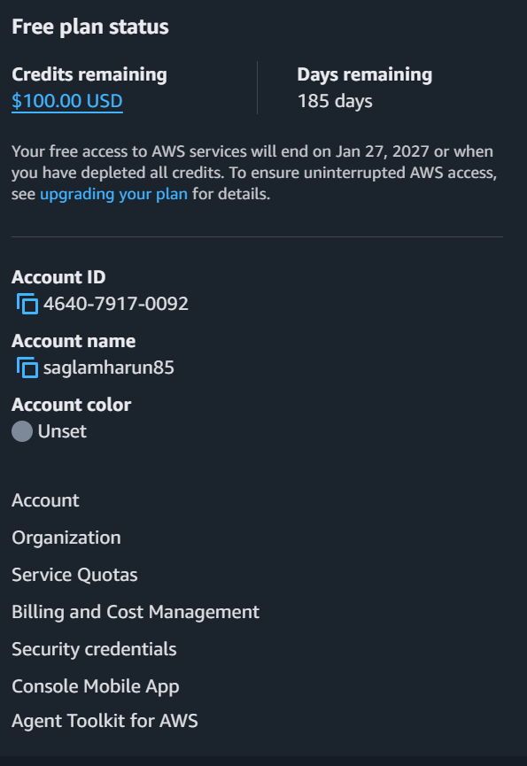

Before deploying anything, I confirmed the account was running on AWS Free Tier with $100 in credits and 185 days remaining — ensuring the entire lab could be built without incurring charges.

### 2. EC2 Instance Configuration
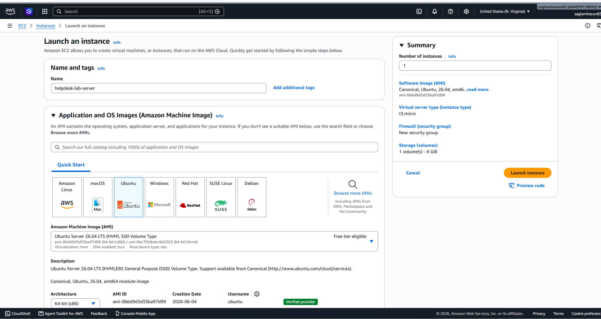

Configured the EC2 instance using Ubuntu 24.04 LTS on a t3.micro instance type, both confirmed as free-tier eligible. A new key pair was generated for secure SSH access, and the security group was configured to allow SSH only from my own IP address — never open to the entire internet.

### 3. Network and Storage Settings
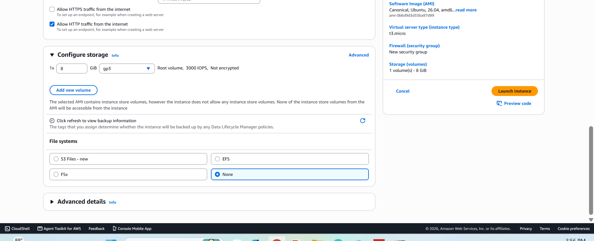

Reviewed the storage configuration (8 GiB root volume, general purpose SSD) and confirmed HTTP traffic was allowed for web server access, keeping the instance within free tier storage limits.

### 4. Instance Running
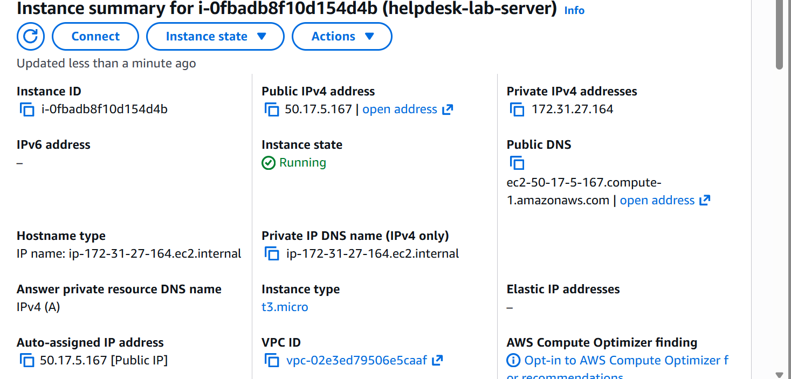

The instance launched successfully and reached the "Running" state with a public IP address assigned, ready for SSH connection and web server deployment.

### 5. SSH Connection Established
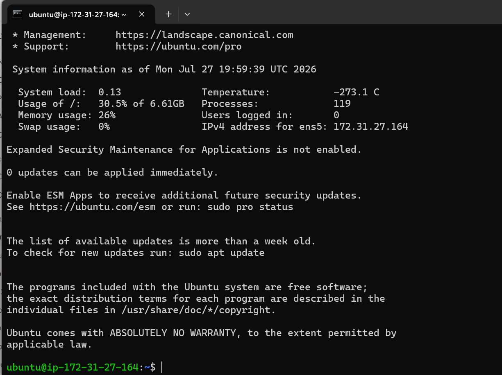

Connected to the live EC2 instance from my local machine via SSH using the generated key pair, confirming direct terminal access to the cloud server.

### 6. Apache2 Installed and Verified
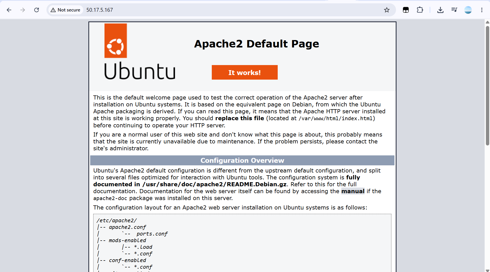

Installed Apache2 via the package manager and confirmed it was serving traffic correctly by visiting the server's public IP in a browser and seeing the default Apache welcome page.

### 7. Custom Server Status Page
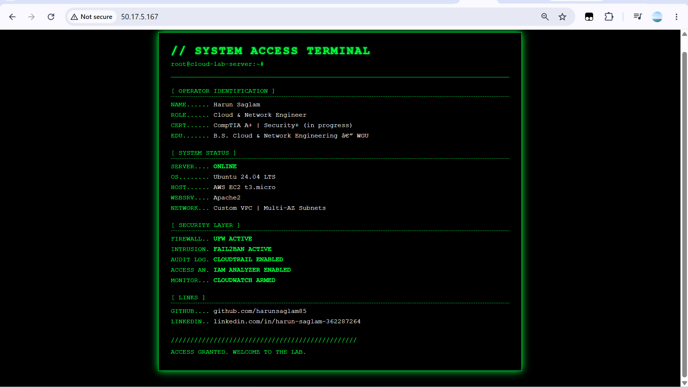

Replaced the default Apache page with a custom-built system status page styled as a terminal interface, displaying live infrastructure details: operator identification, system status, and the full security stack running on the server (UFW, fail2ban, CloudTrail, IAM Analyzer, CloudWatch).

### 8. Custom VPC Architecture
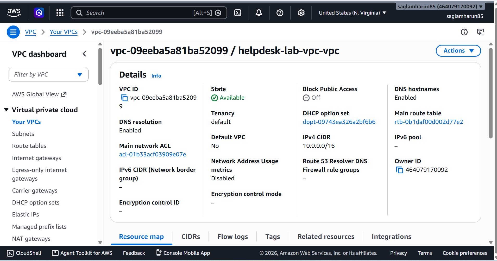

Built a custom VPC using AWS's VPC wizard, creating 4 subnets across 2 Availability Zones (2 public, 2 private), complete with route tables and an internet gateway — proper network segmentation instead of relying on the default VPC.

### 9. IAM Access Analyzer Enabled
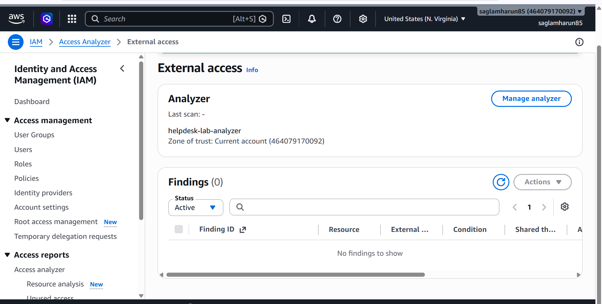

Enabled IAM Access Analyzer to continuously monitor the account for any resources unintentionally shared with external entities — a core AWS security best practice with zero findings, confirming no unintended external access.

### 10. CloudWatch Alarm Configured
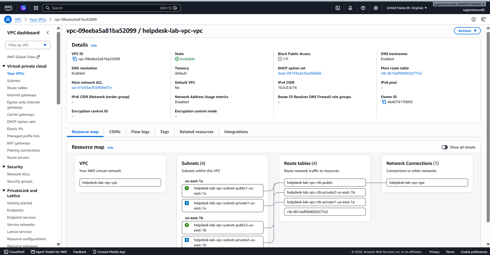

Created a CloudWatch alarm to monitor EC2 CPU utilization, configured to trigger if usage exceeds 80% for a sustained period — proactive performance monitoring rather than waiting for a problem to be reported.

### 11. fail2ban Installed and Running
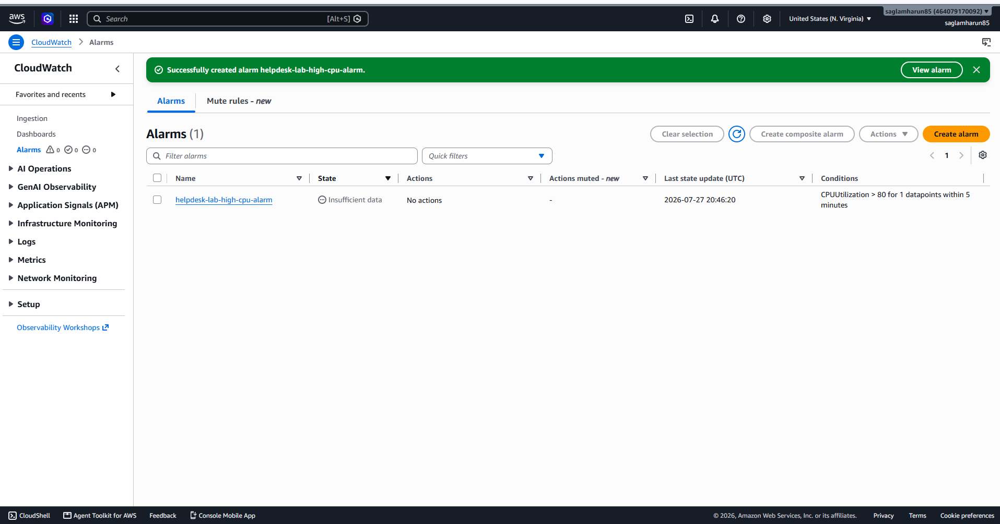

Installed fail2ban and confirmed the service was active and running, configured to monitor SSH authentication attempts with a maximum of 5 failed attempts before triggering a temporary ban.

### 12. Simulated Brute-Force Attack
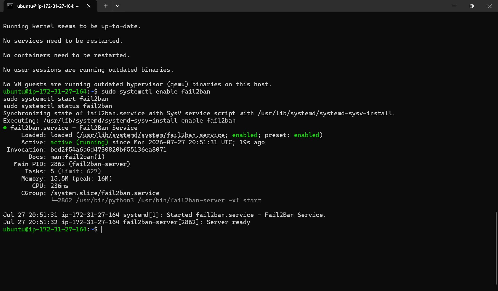

Simulated a brute-force SSH attack against my own server by repeatedly attempting to connect with an invalid username, generating 5 consecutive failed authentication attempts to trigger fail2ban's detection threshold.

### 13. fail2ban Log Detection
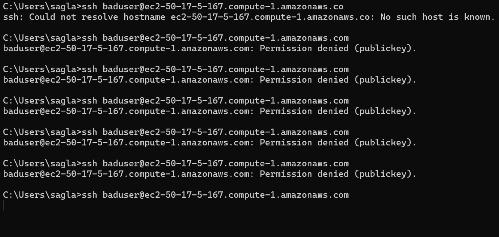

Reviewed the fail2ban log in real time and confirmed it detected the failed login attempts from the source IP, actively monitoring the SSH service exactly as configured.

### 14. Attack Confirmed and IP Banned
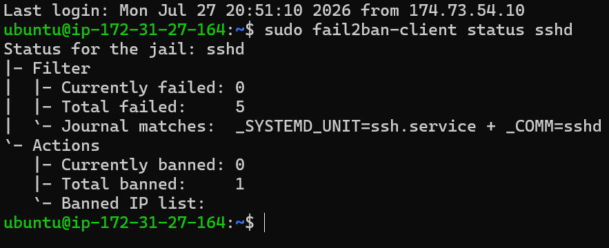

Queried fail2ban's status directly and confirmed the results: 5 total failed attempts detected, 1 IP successfully banned. This is concrete proof the intrusion detection system worked exactly as designed — not just installed, but functionally tested against a real simulated attack.

### 15. UFW Firewall Configured
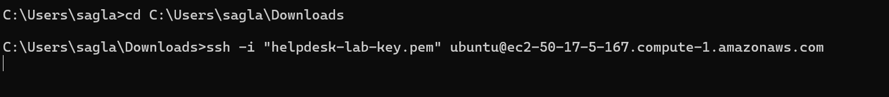

Configured UFW with a default-deny incoming policy, explicitly allowing only SSH (port 22) and HTTP (port 80) — every other port is blocked by default, both for IPv4 and IPv6 traffic.

### 16. Firewall Rule Verification
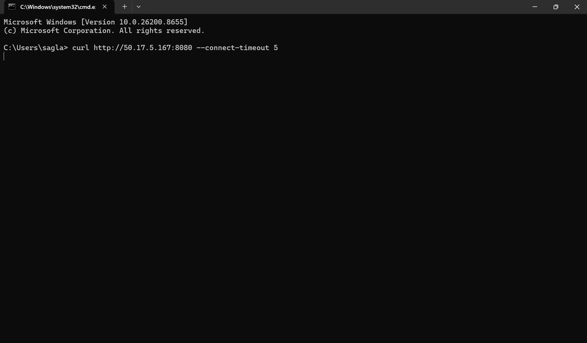

Tested the firewall by attempting to connect to a port that was never explicitly allowed (port 8080). The connection hung and timed out rather than completing, confirming UFW was actively dropping unauthorized traffic rather than just displaying a configuration that looked correct on paper.

## Skills Demonstrated

- AWS cloud infrastructure deployment (EC2, VPC, IAM, CloudTrail, CloudWatch)
- Linux server administration via SSH (Ubuntu 24.04)
- Web server installation and configuration (Apache2)
- Custom network architecture design (multi-AZ VPC, public/private subnet segmentation)
- Host-based firewall configuration (UFW) with default-deny security posture
- Intrusion detection and automated response (fail2ban)
- Security testing methodology — validating controls work rather than assuming they do
- Cloud audit logging and access monitoring best practices
- Performance monitoring and alerting configuration

## Why This Matters

Most portfolio projects show a security tool being enabled. This project shows two independent security layers being tested against real simulated attacks and capturing the evidence — the same standard of verification expected in a real enterprise security operations environment.# aws-cloud-security-lab
AWS cloud infrastructure deployment with layered security monitoring and intrusion detection
